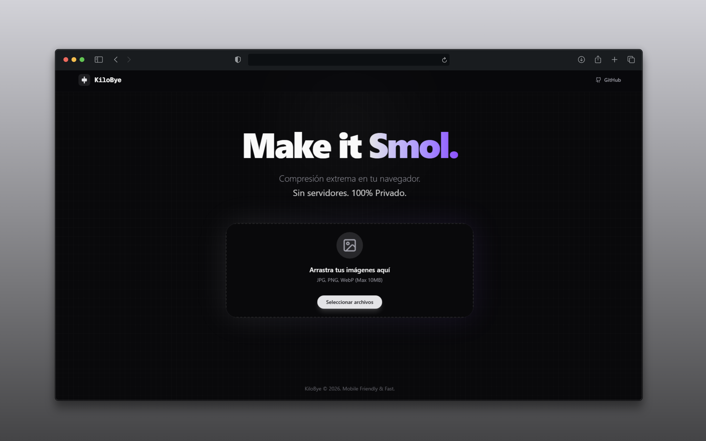

# KiloBye 👾 // Multimedia Optimization Suite

> **Make it smol.**
> Compresión de Imágenes y Vídeo extrema. Privacidad total. Estética Arcade.
> _Press Start to Compress._




## 🎮 De qué va esto

**KiloBye** ha evolucionado. Ya no es solo un compresor de imágenes; es una **Suite de Optimización Multimedia "Privacy-First"**.

A diferencia de las herramientas online que te roban los datos, KiloBye utiliza **WebAssembly (WASM)** para ejecutar motores de compresión potentes directamente en tu navegador. Tus fotos y vídeos **NUNCA** salen de tu dispositivo.

### Arquitectura "Dual-Engine" ⚙️

El sistema decide inteligentemente qué motor utilizar para maximizar el rendimiento:

1.  **Light Engine (Imágenes):** Procesamiento instantáneo vía Canvas y `browser-image-compression`.
2.  **Heavy Engine (Vídeo):** Carga perezosa (Lazy Load) de **FFmpeg.wasm**. El núcleo de procesamiento de vídeo (~30MB) solo se descarga si el usuario activa el "Modo Vídeo", ahorrando datos y memoria inicial.

## ✨ Características (Features)

### 📸 Image Mode

- [x] **Formatos:** JPG, PNG, WEBP.
- [x] **Batch Processing:** Arrastra 50 fotos y procésalas en paralelo.
- [x] **Smart Resize:** Redimensionado automático a 1920px (o personalizado).
- [x] **Conversión:** Cambia de formato al vuelo (ej: PNG a WEBP).

### 📹 Video Mode (NEW)

- [x] **Motor FFmpeg:** La potencia del estándar de la industria, ahora en tu navegador.
- [x] **Control Total:** Tú decides la Resolución (1080p, 720p...), los FPS (30/60) y la Calidad (CRF).
- [x] **Turbo Preset:** Configurado con `ultrafast` para minimizar el tiempo de espera.
- [x] **Barra de Progreso Real:** Feedback visual del renderizado frame a frame.

### 🎨 UX & Core

- [x] **Privacidad Total:** Arquitectura 100% Client-Side.
- [x] **Arcade UI:** Interfaz Pixel Art con sombras duras y tipografía `VT323`.
- [x] **Game Feel:** Efectos de sonido satisfactorios (ASMR retro) y confetti pixelado.
- [x] **Mobile First:** Diseño responsive adaptado a cualquier pantalla.
- [x] **Exportación ZIP:** Descarga todo tu lote comprimido en un solo click.

## 🚀 Tecnologías (The Stack)

Construido con ingeniería moderna de 2026:

- **Core:** [Next.js 16](https://nextjs.org/) (App Router)
- **Lenguaje:** TypeScript (Strict Mode)
- **Video Engine:** `@ffmpeg/ffmpeg` + WebAssembly (WASM) + SharedArrayBuffer
- **Image Engine:** `browser-image-compression` + Web Workers
- **Estado:** Zustand (con persistencia local y lazy init)
- **Estilos:** Tailwind CSS v4 + Shadcn/UI + Framer Motion
- **Audio:** `use-sound` (SFX 8-bit)

## 🛠️ Instalación local

Para correr esto necesitas un entorno que soporte `SharedArrayBuffer` (necesario para FFmpeg).

```bash
# 1. Clonar el repo
git clone https://github.com/EdvinCodes/kilobye.git

# 2. Entrar
cd kilobye

# 3. Instalar dependencias
pnpm install

# 4. Arrancar servidor de desarrollo
pnpm dev
```

Abre [http://localhost:3000](http://localhost:3000).

> **Nota para Devs:** El archivo `next.config.mjs` ya incluye los headers de seguridad (`Cross-Origin-Opener-Policy` y `Cross-Origin-Embedder-Policy`) necesarios para que WASM funcione correctamente.

---

<div align="center">
<p>ENGINEERED BY <a href="https://github.com/EdvinCodes">EDVIN CODES</a></p>
<p>KILOBYE © 2026</p>
</div>
